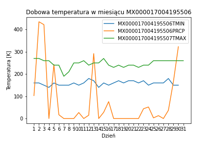
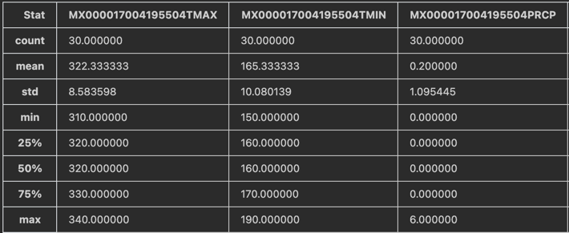
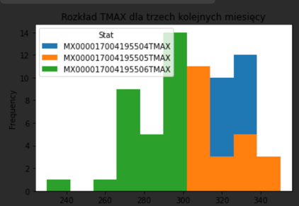

# Opis Danych
Dane znajdują się w pliku weather.txt
Dane reprezentują dzienne pomiary temperatur w przeciągu miesiąca.
Każdy rekord zawiera informację z jednego miesiąca (31 kolumn).
Pierwsza kolumna to nagłówek. Zawiera:
* Kod stacji
* Datę (miesiąc wykonania pomiaru)
* Wartość mierzoną 
  * TMAX - maksymalną dobową temperaturę (float)
  * TMIN - maksymalną dobową temperaturę (float)
  * TPRED - przewidywaną dobową temperaturę (float)
 
Przykładowa reprezentacja dla miesiąca

Przykładowy rozkład wartości dla pierwszego miesiąca:

Przykładowy Histogram

